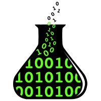

<!-- .element: class="title" -->

# Making sense of Promises <!-- .element style="color: hsla(158, 58%, 40%, 1);" -->

&nbsp;

&nbsp;

Simeon Vincent

<style>
.title .slide-background-content {
  background:
    linear-gradient(to bottom, white 60%, hsla(158, 58%, 40%, 1) 50%);
}
</style>

Notes:
Good morning everyone. Thank you for having me.

My name is Simeon Vincent, though some of you may know me as DotProto on Twitter, Github, npm, and everywhere else.

---

<!-- .element data-background-image="./images/nyantocat.gif" class="dotproto" -->

# <a href="https://twitter.com/DotProto">@DotProto</a>

Notes:

My name is Simeon Vincent, though some of you may know me as DotProto on Twitter, Github, npm, and everywhere else.

For the past 8 or so years I've been working at Blizzard Entertainment, makers of many a beloved game to which I've made only the tenuous of contributions.


---

<!-- .element class="employer" data-background-transition="slide" -->
<style>
  .employer .slide-background-content {
    background:
      url("./images/blizzard_logo.jpg"),
      url("./images/bnet-new-simple.png"),
      linear-gradient(to right, black, black 50%,  #181E2E 50%);
    background-size: 30% auto, 30% auto, 100%;
    background-position: left 20% top 50%, right 22.5% top 50%, 50%;
    background-repeat: no-repeat;
  }
</style>


Notes:

For the past 8 or so years I've been working at Blizzard Entertainment, makers of many a beloved game to which I've made only the tenuous of contributions.

I've spent the past 6 or so years as a front end engineer on the Battle.net team where I've worked on a variety of projects from the community sites like WorldofWarcraft.com to internal tools that help engineers build on the Battle.net platform.

---

<!-- .element data-background-color="hsl(306, 30%, 28%)" -->


# CodeLab OC

Notes:
I'm also a co-organizer of local meetup where I help folks learn about web development and I do some one-on-one mentoring on the side.

Over the past couple weeks I've noticed that a few different people I've been working with don't really **get** promises. I mean, they've worked with them, built features with them, and accomplished (most) of their goals. But they've done so without really understanding promises, which has lead to subtle, frustrating bugs that they're weren't sure how to tackle.

---

# promises … ?


Notes:

Over the past couple weeks I've noticed that a few different people I've been working with don't really **get** promises. I mean, they've worked with them, built features with them, and accomplished (most) of their goals. But they've done so without really understanding promises, which has lead to subtle, frustrating bugs that they're weren't sure how to tackle.

Before we go on, I just want to say it's absolutely OKAY to not know everything. We're all constantly learning. I mean, the JS ecosystem and web development has been going gangbusters for the past decade or so. It's hard to keep up with all the change let alone wrap your head around it when you're brand new.

That said, I think it behooves us as technologists and as software practitioners to understand the core of our platforms -- those technologies we use every day, multiple times a day.

To that end, I'd like to take a couple minutes to break down what promises are and how the work to hopefully demystify them a little bit.

---

# But first …

Notes:
But before we get into Promises, let's talk about the language features that enable asynchronous programming in JavaScript.

Specifically, I'm talking about…

---

<!-- .element style="font-size: 2em;" -->

###  🥇👩‍🏫&ensp;<span style="font-family: serif; text-transform: lowercase; font-size: 1.2em; position: relative; top: -0.05em;"><em>f</em>&thinsp;(x)</span>

&nbsp;

### 📞🔙

Notes:
You guessed it, first class functions and callbacks

---

# First Class Fn

```js
const fn = function() {};

console.log(fn);

(function() {
  return fn;
})();
```
<!-- .element style="font-size: 1.1em; margin-top: 1em;" -->

Notes:
The term "first class function" is basically just a fancy way of saying that functions can be treated like like any other kind of data in the language.

You can assign them to variables, pass them as arguments, return them from other functions, and otherwise use them like any other piece of data.

---

# Callbacks

```js
function callback() {
  alert('Hello, world!');
}

document.addEventListener('click', callback);

setInterval(callback, 32000);
```
<!-- .element: style="font-size:.8em; margin-top: 1em;" -->

Notes:
Next, we've got callbacks. A callback is just a function that we pass to another piece of code which will call that function when something relevant happens.

Here we're declaring a function that we want to use as a callback and giving it the clever name "callback".

Next, we pass that function into `addEventListener` and bind it to the "click" event so that every time someone clicks anywhere on this page they'll get annoyed.

The key bit here is that we've prepared some work that we want to run when some condition is met, then we hand it off to some other part of the system for execution. It could get called immediately or never, but we don't have to worry about how that's scheduled and checked.

---

# async

# 🍔💨 <!-- .element class="fragment" -->


Notes:
All right, now that we've covered the basics of asynchronous programming in JavaScript. Let's talk about ordering fast food.

Okay, I know. Bare with me.

---

<!-- .element class="order" -->

<h1>&emsp;&emsp;&emsp;&emsp;🗨️🧕</h1>
<h1 class="fragment">💁‍✅&emsp;&emsp;&emsp;&emsp;</h1>
<h1 class="fragment">‍&emsp;&emsp;&emsp;&emsp;🏄🕸</h1>
<h1 class="fragment">‍💁‍📢️&emsp;&emsp;&emsp;&emsp;</h1>
<h1 class="fragment">&emsp;&emsp;&emsp;&emsp;🍔😊</h1>

Notes:
1. Start by giving them your order and your name
2. Once you've paid you're all set
3. Step to the side and do some important work like surfing the web. While you're doing that the resaurant works on your order
4. Once it's ready they call out your name
5. You get your food and the world is good

This exchange actually models single call callback interaction pretty well.

---

<!-- .element class="order" -->

<h1>&emsp;&emsp;&emsp;&emsp;🗨️🧕</h1>
<h1 class="fragment">💁‍📑&emsp;&emsp;&emsp;&emsp;</h1>
<h1 class="fragment">‍&emsp;&emsp;&emsp;&emsp;🔨🍬</h1>
<h1 class="fragment">‍💁‍📢️&emsp;&emsp;&emsp;&emsp;</h1>
<h1 class="fragment">&emsp;&emsp;&emsp;&emsp;🍔😊</h1>


Notes:
Promises aren't too different. Let's take a look at a promise-based version of the same exchange.

1. Start by giving the attendant your order
2. Once you've paid, they give you a receipt with your order ID. This is your promise
3. Again, you take care of vital work like destroying candies or whatever
4. Your order ID is called
5. And you respond by chowing down

---

<p>&nbsp;</p>
<p>&nbsp;</p>
<p>&nbsp;</p>

<h1 style="font-size: 5em;" class="">
  📑
  <span class="fragment fade-children" style="position: absolute; --duration: 100ms;">
    <span style="--delay:100ms; position: absolute; right: -0.2em; top: 0.2em;">📑</span>
    <span style="--delay:200ms; position: absolute; right: -0.4em; top: 0.4em;">📑</span>
    <span style="--delay:300ms; position: absolute; right: -0.6em; top: 0.6em;">📑</span>
    <span style="--delay:400ms; position: absolute; right: -0.8em; top: 0.8em;">📑</span>
    <span style="--delay:500ms; position: absolute; right: -1.0em; top: 1.0em;">📑</span>
    <span style="--delay:600ms; position: absolute; right: -1.2em; top: 1.2em;">📑</span>
    <span style="--delay:700ms; position: absolute; right: -1.4em; top: 1.4em;">📑</span>
    <span style="--delay:800ms; position: absolute; right: -1.6em; top: 1.6em;">📑</span>
    <span style="--delay:900ms; position: absolute; right: -1.8em; top: 1.8em;">📑</span>
    <span style="--delay:1000ms; position: absolute; right: -2.0em; top: 2.0em;">📑</span>
    <span style="--delay:1100ms; position: absolute; right: -2.2em; top: 2.2em;">📑</span>
    <span style="--delay:1200ms; position: absolute; right: -2.4em; top: 2.4em;">📑</span>
    <span style="--delay:1300ms; position: absolute; right: -2.6em; top: 2.6em;">📑</span>
  </span>
</h1>

Notes:

These two flows look very similar because they're two ways of achieving the same goal: getting notified when your food is ready. But rather than having the attendant call your name (i.e. your callback function), they gave you a receipt (a promise).

Say you had to take a call while you were waiting, so you step outside. Even though your friend (did I mention you had a friend there) is still inside, your friend doesn't even hear it when they announce that your order is ready because your name is *your* callback. Unless you specifically set up a callback handler that would notify your friend when your order completed they have no way of knowing about your callback.

Ah, but in the promise example you could pass your friend a reference to your promise which would allow them to react when your order completes.

**[[CLICK]]**

Ultimately walking about code, so promises aren't constrained by the limits of physical systems. Since a promise is just a JS object, you can make pass your each of your friends a reference to the promise, and they can each respond to the completion event as they see fit.

---

```js
// sim.js
const order = restaurant.placeOrder('burger');
```
<!-- .element: style="font-size:.78em;" -->

&nbsp;

```js
order.then(function simOnSuccess(food) {
  console.log(`I got a ${food}!`)
});
```
<!-- .element: class="fragment" style="font-size:.78em;" -->

&nbsp;

```js
// friend.js
simOrder.then(function friendOnSuccess(order) {
  console.log(`Sim's friend has a ${order}!`)
});
```
<!-- .element: class="fragment" style="font-size:.78em;" -->


Notes:

I've gotten a little hand wavy here, so let's concretize this by looking at some sample code. We're going to do the exact same thing we just did, but this time in JS.

In this first code block we're placing an order with the restaurant. This call will return a promise which we'll save to a constant called `order`.

Next, we'll use the promise's `.then()` method to register a callback that will be called the promise completes successfully.

And since the promise is just an object, we can pass it to another part of our application (represented here by our "friend" script) so it can also register a success callback.

---

<!-- .element class="then-slide" -->

```js
// Register a success callback
promise.then(function onSuccess(value) {});
```

```js
// Register both success and error
promise.then(
  function onSuccess(value) {},
  function onError(reason) {},
)
```
<!-- .element class="fragment" -->

```js
// Register an error callback
promise.then(null, function OnError(reason) {})
```
<!-- .element class="fragment" -->

```js
// Register an error callback
promise.catch(function onError(value) {});
```
<!-- .element class="fragment" -->

Notes:

In the previous example I mentioned the promise instance `.then()` method only in passing, but this simple method actually is actually quite powerful.


---

ALPHA BETA GAMMA

Notes:

Okay, at this point we've shown how Promises can fill a similar role to a traditional callback and we've touched on one of their key differentiators.

Another really key aspect of working with promises is the concept of chaining.

---


# Other Topics

- Chaining
- Error handling
- Other language features built on promises
    - Async functions / await
    - Async iterators / for-await-of
    - (Proposal)
- Promise instance methods
    - then
    - catch
    - finally
- Promise methods
    - all
    - race
    - reject
    - resolve

---

# TODO

🔗⛓📝📑📆


- `[ ]` List of APIs that use promises
    - Fetch
    - Async iterators & for await of
- `[ ]` Promise concepts
    - `[ ]` resolve / reject
    - `[ ]` Chaining
- `[ ]` Trickier stuff
    - `[ ]` Promise.race()

---


<!--

1. Prep some work

    `var 💼 = () => console.log('👌')`

    &nbsp;

2. Pass it on

    `setTimeout(💼, 1000)`

3. 🤹

-->


Now since my talk was a promise, you'll have to let me know if it succeeded.

# 🙄<!-- .element: class="fragment" -->